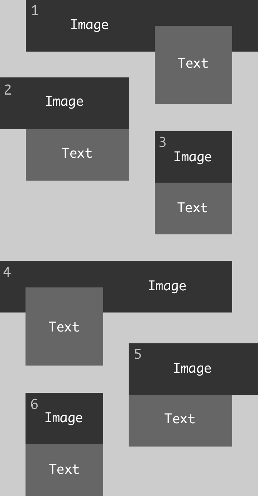
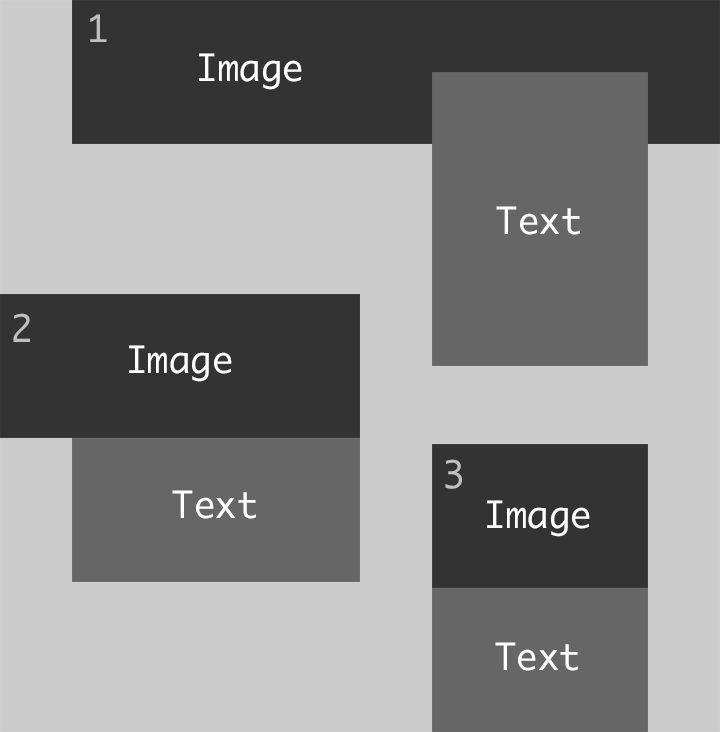
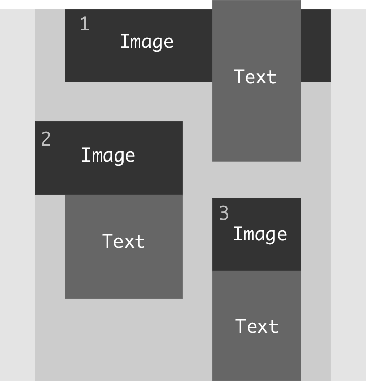

One reason frontend development never becomes boring is the fact that the available technologies evolve rapidly. Browser vendors publish new features every few weeks, which makes it hard to stay up-to-date. At the same time it also makes development much easier as as a lot of functionality gets introduced by the new browser versions.

When working on a project, it is now completely normal for me to implement its layout or features with Flexbox – or in some (still rare) cases with CSS Grid. Both make implementing most layouts much easier.

The last project I worked on seemed to be such a case. One main element of it was a teaser list, which was supposed to look roughly like this:

The important part here was that the vertical space between the teasers was the same as the horizontal space.

A colleague of mine started implementing it using CSS Grid, splitting it up in 12 columns, repeating rows, spanning content over multiple columns etc.. It worked well and using CSS Grid seemed like an obvious choice, but unfortunately we realized that the Internet Explorer (yes, we still had to support it) didn't support some of the CSS Grid features that were used. When my colleague went on holidays, I took over and tried to adapt the Grid solution, so that the IE would support it and we didn't have to throw away all the code. I realized though that it just wouldn't work, so I changed the code to use Flexbox which was actually not a big change. The main principle was the same: I just had to use some other attributes, doing minor tweaks and was done pretty quickly.

Later on I realized that the horizontal space between the teasers was not correct yet. In my solution, the small teasers (2, 3, 5 and 6) were always aligned to the bottom of the big teasers (1 and 4). I had then pulled up teaser 2 and 5 with negative margins to put them in the right position. It looked perfect, but only due to some bad dummy data and other coincidences, making all the text boxes have the same height. Of course their height needed to be flexible though. So, with more realistic data it looked somewhat like this:

As you can see here, the space between teaser 1 and 2 became too big because the text box in teaser 1 pushed down everything.

My next idea was to take the text boxes of teaser 1 and 4 out of the flow, using `position: absolute` to align it at the bottom of the big image and then pulling it down by a fixed value. That way all small teasers would align to the bottom of the big images and I could pull down the teaser 3 and 6 by the same value I pulled down the text boxes of teaser 1 and 4. 
The designer was fine with this solution, but the variable height of the text boxes in teaser 1 and 4 was a problem again as they could theoratically become higher and higher. Especially on smaller viewports, the text box becomes too high quickly as it is narrower and expands to the top:

I thought about it quite a bit and was sure that there is no way to implement this layout with flexbox. 
Since there must be a way though, I was then trying to find another way to take the text boxes out of the elements flow – until `float` came into my mind. 
Having it used for many years for almost every layout I implemented, I had now almost completely forgotten it. Trying around a little bit, it took just a few minutes to actually have the complete solution. The steps for that roughly were:

- Float the text boxes of teaser 1 to the right. That way the text box doesn't have any impact on the height of its containing teaser and the following teaser is automatically aligned to the bottom of the image (technically correct: to the bottom of the teaser).
- Now set `float: left` on teaser 2 and `float: right` on teaser 3. That way teaser 3 is placed next to the teaser 2. But most importantly, it aligns to the bottom of the text box in teaser 1. That is because a floated element still reserves space (unlike elements with `position: absolute`), it just doesn't influence its containers height.
- Now I could do the same with the teasers 4, 5 and 6, but inverted.

That was it. A modern looking layout with quite oldschool code, completely supported in all browsers without any polyfills or vendor prefixes.

You can find a basic implementation here:

  See the Pen <a href="https://codepen.io/mgrsskls/pen/9b1fcbee8879f6f6b6717e8255c286b0/">
  float layout</a> by Michael Groklaus (<a href="https://codepen.io/mgrsskls">@mgrsskls</a>)
  on <a href="https://codepen.io">CodePen</a>.

Implementing this made me realize that there are so many things happening in the frontend world, that we almost forget about some of the most basic features. It is important to be aware of new developments as they can make a developers life much easier. But while new technologies often still need tooling around them, knowing the basics is crucial to write accessible, simple and widely supported code.
