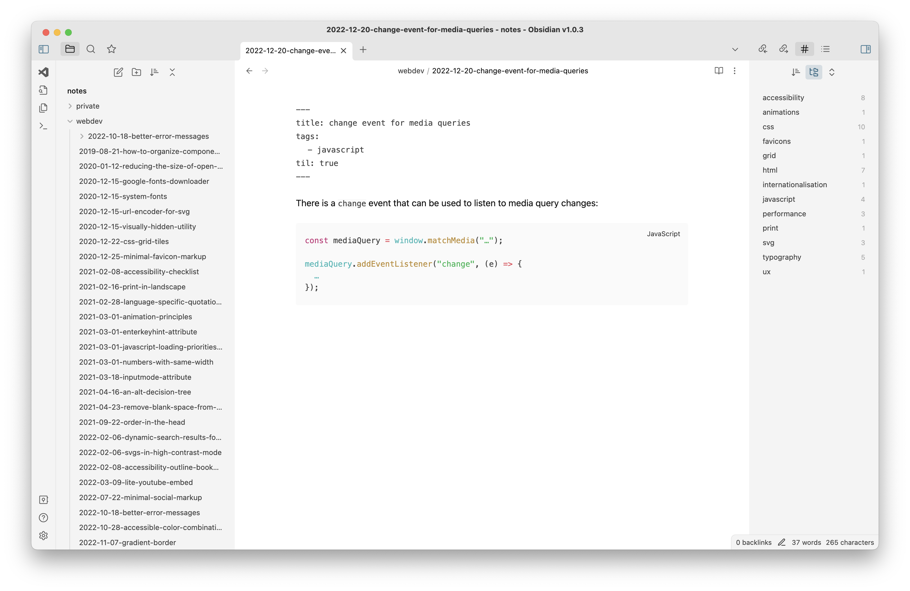
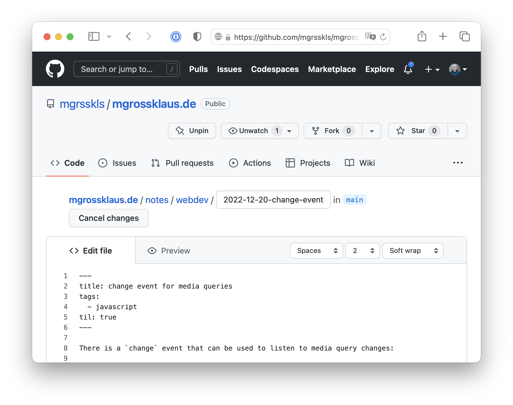

I have a lot of private notes regarding all kinds of topics: web development, my hobbies, finances, things to buy, work-related tasks, and so on. These notes are probably the most important things I have digitally (besides thousands of pictures) and up until recently they were stored in a PostgreSQL database. This had always been a compromise though. What I actually wanted was to store them in Markdown files on my computer.

I just love Markdown for multiple reasons:

- Its simplicity when it comes to writing down any kind of information.
- It can easily be converted to HTML.
- It can be stored anywhere (and especially locally on my computer).
- It is an open standard which is supported by many tools.

The reason I want them to be stored on my computer is independence: I don't want to rely on some 3rd party infrastructure for something such important.

## Using Obsidian for working with my notes

What I was missing until now was a tool for macOS that makes it easy to create and read my notes — until I stumbled upon [Obsidian](https://obsidian.md). While I am not super fond of its UI (it looks a little bit too techy for me), it did almost everything out of the box the way I wanted it to. Unfortunately it is not open source, but it has a very big amount of community plugins. The small things that were not possible with Obsidian's core plugins, were easy to do with their community plugins: for example keeping the file name in sync with the first heading in a Markdown file ([Filename Heading Sync](https://github.com/dvcrn/obsidian-filename-heading-sync)).

## Using private and public notes together

Using Obsidian for my private notes would have already been enough for me, but then I thought it would be nice to use it for the notes on this website as well, since they are also written in Markdown. And while Obisidian supports multiple vaults (which is their name for a directory containing Markdown files), I wanted to avoid that as this opens multiple windows — which I don't like at all.

What I did instead was to move my private notes into [the repository of this website](https://github.com/mgrsskls/mgrossklaus.de/) (which is built with [Eleventy](https://https://www.11ty.dev)), configure Eleventy so that it only uses my public notes and add the directory with the private notes to the `.gitignore`, so I don't publish them on GitHub. 
It does not matter at all to me where on my disk the private notes are stored as Obisidian abstracts that away and opens the vault automatically when restarting the app.

Now I have one application that gives me all my notes, private and public, and a codebase that allows me to publish only the public ones.

## Publishing public notes

The way I usually publish notes on this website is through GitHub directly: The GitHub Web UI allows you to create files and commit them in one go. This is super convenient as I don't have to open my editor, create a file, commit and then push it. Instead I bookmarked the URL for creating a new file in the correct directory (_https://github.com/mgrsskls/mgrossklaus.de/new/main/notes/webdev_ in my case), which brings me directly to GitHub's file editor. And as most of the notes I write are Markdown files without any additional files (images for example), using the GitHub Web UI is totally sufficient in most cases.

## Pulling notes from the repository

Of course the notes that I published via the GitHub Web UI would not be on my computer without pulling them into my local repository. As doing that how you would usually pull changes would be quite annoying, I created a small app that does that for me: In macOS' Automator app, I created an "Application", chose "Run shell script" and in there I simply use `cd` to go into the directory of the repository and then run `git pull`. I can then use [Alfred](https://www.alfredapp.com) to quickly run the program, which happens completely in the background, so no windows open or anything like that.
This is of course does not handle any errors in case pulling fails for example, but in my case I don't really need that.

## Syncing with an iOS app

One thing that would be nice to have is being able to maintain those notes on my phone as well. Obsidian offers encrypted synchronisation for that, but as the code is not open source, I don't want to rely on that. There are multiple community plugins that allow you to do that (using services like Dropbox or a CouchDB for example), so I might look into that at some point (probably using a self hosted database).
