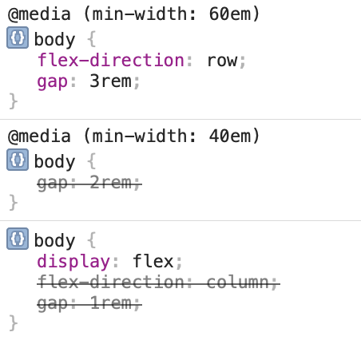
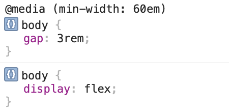

In this post I want to give a short example why there is in my opinion a better way than using a *Mobile First* approach when writing CSS. Please note that for simplification I will refer to *viewports* as well as *media queries*, but the same concept also applies to anything that can be controlled by media and container queries.

## Mobile First

When Responsive Web Design and media queries became a thing, it was considered best practice to follow a *Mobile First* approach when writing CSS for a website. Besides being aligned with the conceptual *Mobile First* approach (where you — in simple terms — first make sure that your *content* and its structure works on small devices), this also had the advantage to support browsers that did not yet support media queries. For those you got the mobile view.

An example for that would be something like this simple page layout:

```html
<body>
	<main></main>
	<aside></aside>
</body>
```


```css
body {
	display: flex;
	flex-direction: column;
	gap: 1rem;
}

/* medium */
@media (min-width: 40em) {
	body {
		gap: 2rem;
	}
}

/* large */
@media (min-width: 60em) {
	body {
		flex-direction: row;
		gap: 3rem;
	}
  
	main {
		flex: 3;
	}
  
	aside {
		flex: 1;
	}
}
```

In this case we first use `flex` with columns, so that the `<main>` and `<aside>` elements are below each other. This could be done without defining any CSS at all as they are both block elements, which would be rendered in a column anyway. But using `flex` allows us to use `gap` which is unfortunately not (yet) supported on block elements.

In the first media query we increase this `gap` for medium viewports.

In the second media query we then set `flex-direction` to its initial value `row` , so the `<main>` and `<aside>` elements are horizontally aligned. We also redeclare the `gap`. Additionally we set `flex` values for our two elements, so that `main` takes more space than `aside`.

If you look at the media query for medium viewports, you also notice that the media query only uses `min-width`, so it is basically open ended and has no limit in terms of width. As you can see all we do in there is defining the `gap` (for medium viewports), which we then overwrite again in the next media query (for large viewports).

Besides the fact that it is not necessary anymore to go for a *Mobile First* approach when it comes to CSS since media queries have been supported in all major browsers for a long time now, this approach also comes with two downsides:

1. **Error prone:** If we want to add or change CSS for small or medium viewports, this CSS would bleed up, i.e. affecting larger viewports. This means we might introduce a bug, if we do not undo our changes for larger viewports. So, writing CSS code this way is very error-prone because changes might have unintended side-effects.
2. **Difficult to inspect:** Inspecting why something behaves a certain way becomes more difficult. You end up with properties being overwritten, sometimes even multiple times. This can be seen when looking at the devtools where you would have lots of striked through properties. This is a screenshot of the devtools for large viewports:
   
   
   This is of course a short example, but imagine how this quickly escalates in an actual, more complex website. Seeing lots of overwritten properties like this is usually a good indicator that the CSS is prone to errors and might be worth a refactoring.

## Shared First

So, how can we change our CSS to avoid these issues? What works really well for me is an approach that I would call, for lack of a better name, *Shared First*.

In this approach you only define CSS outside of media queries which should be **shared by viewport sizes** and everything that should only be applied for certain viewport sizes goes into a media query that matches only that viewport size:

```css
body {
	display: flex;
}

/* small + medium */
@media (max-width: 59.96875em) {
	body {
		flex-direction: column;
	}
}

/* small */
@media (max-width: 39.96875em) {
	body {
		gap: 1rem;
	}
}

/* medium */
@media (min-width: 40em) and (max-width: 59.96875em) {
	body {
		gap: 2rem;
	}
}

/* large */
@media (min-width: 60em) {
	body {
		gap: 3rem;
	}
	
	main {
		flex: 3;
	}
  
	aside {
		flex: 1;
	}
}
```

Let's break this down:

1. Outside of all media queries, we first define everything, that is shared: in our case, all we do is turning `<body>` into a `flex` element as this is the only thing that is shared throughout all viewport sizes.
2. The first media queries covers small and medium viewports. In there all we define is that for these sizes we want to use a column layout. This makes sure that we later do not have to revert this.
3. The `gap` is then defined in each media query: We explicitely define it once for small, once for medium and once for large viewports. This allows us to change the values without accidentally affecting other viewport sizes.

Admittedly, these are a few more lines than in the *Mobile First* approach, but shorter code does not always mean better code. Instead shorter code might be harder to understand and more difficult to maintain.

### Why does this work better?

First of all, by declaring CSS only for the resolutions we actually need it, we avoid side effects.
Let's say on small viewports we now want to change the font size, we can do that by adding it to the media query for small viewports without any side effects. In the *Mobile First* approach this would have caused a regression if we did not revert that definition for larger viewports.

Second of all, inspecting this is much easier. This is how devtools would look for our *Shared First* example for large viewports:


Much cleaner, isn't it?

## Summary

Using a *Mobile First* approach when writing CSS is error prone and often leads to unintended side effects. It is also more difficult to investigate what is happening in the CSS.
This can be avoided using a *Shared First* approach where only the CSS, that should be applied for all viewport sizes, is defined outside of media queries. The CSS, that should only be applied for certain viewport sizes, will go into media queries that are defined to match only those exact viewport sizes.

## Disclaimer

I know that there might be shorter and easier ways to write this layout example using custom properties, but this is simply an example to illustrate the issues and benefits.